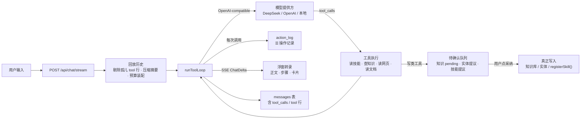

# Agent-Jarvis 架构图

> 截至 2026-09-28（main `3c922a2`，CR-20260928-server-strings-i18n 分支基点）。本文件是架构图的**源**；可分享的页面版由它派生（https://claude.ai/artifact/TLFbGtPytg96k9L5PazCzA ，私有链接，改后重新发布）。
> **维护规则见文末**：凡动了模块、路由、表、依赖或部署形态的 CR，都要在同一变更里更新本文件；`tests/architecture-doc.test.ts` 逐项核对附录清单，漏了直接红。

一个 Node.js 进程同时提供页面与 API：浮窗对话把用户消息交给工具循环，模型在循环里读技能、查知识库、读网页与文档、提出写入提议；写入先进待确认队列，用户点采纳才生效，每次工具调用都落到操作记录。数据全部在 `.data/`（SQLite + 文件），本机与 Railway 各跑一份同样的构建。

技术栈：Next.js 15.5 App Router + React 19 · TypeScript · Tailwind v4 + 本地 shadcn primitives（`src/components/ui/*`）· Node 24 `node:sqlite`（无 ORM）· Python 3.13 markitdown（子进程）· SSE 流式 · OpenAI-compatible 适配 · 单进程、无队列、无反向代理。

## 1. 分层总览

自上而下是一次请求穿过的层；每层只经相邻层交互。

### 1.1 浏览器界面

一页三个面：全屏展示屏为底，对话与 ☰ 抽屉浮在其上（z-index 0 / 20 / 30）。组件之间只用 `window` 事件对话（`ui-events.ts`），互不 import。界面文案全部出自 `src/lib/i18n.ts` 的 zh / en 字典：`page.tsx` 用服务端保存的语言（`ui.language`）渲染首帧并注入 `LanguageProvider`，组件经 `useT()` 取词，☰ 切换即时重渲染；`tests/ui-strings-guard.test.ts` 禁止组件里再出现中文字面量。

| 面 | 职责 | 组件 |
|---|---|---|
| 展示屏 | 标题视图 / 洞察报告 / 文档；会话态看板：知识看板、竞品、行业指标对照、组织架构；设置面板可唤到屏上 | `DisplayScreen`、`KnowledgeDashboard`、`LibraryPanel`、`CompetitorBoard`、`IndustrySpecComparison`、`OrgChartBoard`、`ToolPanel`、`ModelSettings` |
| 浮窗对话 | 消费 SSE：正文、工具步骤行、压缩边界、来源；实体提议卡 / 技能提议卡；拖放上传技能与资料；状态灯、停止、新对话、折叠 | `FloatingChat`、`EntityProposalCard`、`SkillProposalCard` |
| ☰ 抽屉 | 外观（主题、语言——同时决定界面语言与回复语言）、模型、账号、技能（含待确认）、知识库（含待采纳）、文档设置、搜索与用量、主动唤醒、操作记录 | `CornerMenu`、`MenuSection`、`ThemeToggle`、`LanguageProvider`、`LanguageToggle`、`SettingsDialog`、`AccountDialog`、`SkillList`、`KnowledgeList`、`DocumentSettings`、`SearchSettings`、`WakeSettings`、`ActionLog`、`Dialog`、`ConfigWarning` |

首帧由 RSC 注水（`src/app/page.tsx` 读服务端状态作初始 props）；之后经 `fetch` + `ReadableStream` 消费 SSE，`AbortController` 停止。

### 1.2 路由层（Next.js Route Handlers，与页面同进程）

每条先过身份守卫（`auth-guard.ts`：Railway 上真实 Google OAuth 会话；本机回环地址走单管理员）与存储可用性守卫（`api-guard.ts`）。回到界面的 `message` 全部出自服务端字典 `i18n-server.ts`：路由入口用 `i18n-request.ts` 的 `requestTranslator()` 读一次全局 `ui.language` 绑定 `t`；领域模块抛出的类型化错误带 `code`（`coded-error.ts`，中文 `message` 由字典派生，工具路径照旧），路由边界用 `messageFor(t, error)` 按当前语言成句。

| 组 | 路由 |
|---|---|
| 对话 | `/api/chat/stream`（SSE）· `/api/chat/wake` · `/api/conversations/recent` · `/api/conversations/[id]/messages` |
| 能力配置 | `/api/providers` · `/api/providers/[id]` · `/api/providers/probe` · `/api/providers/test` · `/api/settings/search` · `/api/settings/search/test` · `/api/settings/wake` · `/api/settings/documents` · `/api/settings/language` · `/api/tools` |
| 知识与对象 | `/api/knowledge` · `/api/knowledge/[name]` · `/api/knowledge/overview` · `/api/knowledge/pending/[name]` · `/api/entities` · `/api/entities/[name]` · `/api/entities/[name]/history` · `/api/entities/pending/[name]` · `/api/entities/proposals/[id]` · `/api/entities/sweep` · `/api/library` · `/api/library/browse` · `/api/library/decide` |
| 技能与产出 | `/api/skills` · `/api/skills/[name]` · `/api/skills/proposals` · `/api/skills/proposals/[id]` · `/api/insights` · `/api/insights/archive` · `/api/display` · `/api/documents/raw` · `/api/actions` |
| 身份 | `/api/auth/[...nextauth]` |

### 1.3 对话核心

一次发送 = 多次模型调用的循环。核心不 import 任何具体工具，只经注册表取描述符（grep 守卫）。

| 模块 | 职责 |
|---|---|
| `chat.ts` `runChatTurn` | Provider 链解析与失败下沉、历史回放（剔除孤儿 tool 行 `dropOrphanToolResults`）、压缩摘要、预算装配、同会话单轮互斥（`inFlightTurns`）、每调用落账、SSE 编排；稳定前缀 identity 带回复语言指令（`language.ts`，全局设置 `ui.language`，默认中文） |
| `agent-loop.ts` `runToolLoop` | 调用模型 → 并发执行 `tool_calls` → 回喂 → 再调用；100 步上限、15 s 工具超时、重复失败短路、本轮成本上限；`onAction` 落账 |
| `tools/registry.ts` · `tools/budget.ts` | `ToolDescriptor`（优先级 essential / normal / management，可用性，`effect` read / write / network）；上下文预算、保留窗口、压缩计划、前缀稳定 |
| `adapters.ts` | OpenAI / DeepSeek / 本地 OpenAI-compatible 统一走 `/chat/completions`，流归一为 `ChatDelta`，工具调用分片累积、usage、截断标记、`stream_options` 回退 |
| `providers.ts` · `crypto.ts` · `runtime-config.ts` | Provider 模板与探测；凭据 aes-256-gcm；运行配置读取 |

### 1.4 工具与领域模块

模型能调的每个工具背后是一个领域模块；写类工具要么落待确认队列，要么对已登记来源直写。

| 领域 | 工具 | 模块 |
|---|---|---|
| 技能 | `list_skills` `read_skill` `search_skills` `register_skill`（只落提议） | `skills.ts` `skill-proposals.ts` `zip.ts`（自写 zip 解析）· `tools/skill-tools.ts` |
| 知识库 | `search_knowledge` `read_knowledge` `save_knowledge`（进 pending）`ingest_url` `classify_knowledge` | `knowledge.ts` `ingest.ts` `extract.ts` `sources.ts` `html-text.ts` · `tools/knowledge-tools.ts` |
| 跟踪对象 | `propose_entity` `propose_entity_update` `propose_person` `add_source` `fetch_source` `extract_fields` 与读取类 | `entities.ts` `entity-proposals.ts` `entity-history.ts` `sweep.ts` · `tools/entity-tools.ts` |
| 文档与资料库 | 本地目录只读检索与读取；资料库采纳与浏览 | `documents.ts` `library.ts` `markitdown.ts`（PDF/DOCX → HTML 子进程）`document-format.ts`（按排版技能重排、按内容缓存）`pdf-text.ts` · `tools/document-tools.ts` |
| 联网 | `web_search`（SearXNG）`read_url`（地址校验、PDF 抽取、被拦截时浏览器回退） | `tools/web-tools.ts` `tools/url-guard.ts` `tools/browser-fetch.ts` |
| 展示与主动性 | `show_home` `show_insight` `save_insight` 与各看板阶段 | `display.ts` `display-document.ts` `insight-export.ts` · `tools/display-tools.ts`；`wake.ts` 主动唤醒（按日上限一次非流式调用） |
| 横切 | — | `store.ts` `store-singleton.ts` `migrations.ts`（`PRAGMA user_version` 迁移框架）`user-data-paths.ts`（按用户数据根）`language.ts`（语言设置与回复指令）`i18n-core.ts`（查表核心）`i18n.ts`（界面文案字典 zh / en 与 `t`）`i18n-server.ts`（服务端文案字典：接口 message、对话通知、步骤行状态、领域错误、压缩与唤醒提示词）`i18n-request.ts`（请求级翻译器）`coded-error.ts`（带 `code` 的类型化错误与 `messageFor`）`transcript.ts` `send-failure.ts` `supervisor-policy.ts` `types.ts` `ui-events.ts` `utils.ts` `auth.ts` |

### 1.5 数据

全部在 `.data/`。SQLite 存结构化状态，文件存内容；按用户隔离的根目录由 `user-data-paths.ts` 解析。

| 数据 | 存放 | 说明 |
|---|---|---|
| 会话与消息 | `conversations` · `messages` | tool 往返按 `(created_at, seq)` 无损回放；压缩摘要作 `system/summary` 行插在边界处；累计用量在会话行 |
| 用户与模型提供方 | `users` · `providers` | API Key 用 `JARVIS_SECRET_KEY` aes-256-gcm 加密；优先级、工具能力探测结果、上下文窗口 |
| 技能 | `skills` + `.data/skills/<slug>/` | SKILL.md 与附属文件原样落盘；`skill_proposals` 存待确认的正文，采纳时才生成文件 |
| 知识条目 | `users/<email>/knowledge/*.md` | frontmatter + 正文；`pending/` 子目录是模型提议，采纳后移入 |
| 跟踪对象 | `users/<email>/entities/` | 实体文件、来源、`proposals/*.json` 字段提议、变更历史 |
| 资料库 | `资料库/`（git）· `.data/library/` · `.data/document-format/` | 参考 PDF 随仓库分发；采纳的原件与排版缓存在 `.data` |
| 展示屏与报告 | `insights` · `display_state` | 报告 HTML 原样存储（未沙箱 iframe，DEC-015 已登记风险）；展示指针全局单行 |
| 应用设置 | `app_settings` | 搜索后端、排版技能、文档目录、回复语言（`ui.language`）等键值 |
| 操作记录 | `action_log` | 每次工具调用一行：工具、effect、结果、参数摘要、所在会话 |
| 治理基线 | `project/.governance/baseline.json` · `ledger.jsonl` | 受控文件哈希与哈希链台账 |

### 1.6 外部依赖

运行依赖（npm）：`next`、`react`、`react-dom`、`next-auth`、`playwright-core`，UI 层的 `lucide-react`、`class-variance-authority`、`clsx`、`tailwind-merge` 与 Radix primitives（`@radix-ui/react-dialog`、`@radix-ui/react-dropdown-menu`、`@radix-ui/react-label`、`@radix-ui/react-scroll-area`、`@radix-ui/react-separator`、`@radix-ui/react-slot`、`@radix-ui/react-switch`、`@radix-ui/react-tooltip`）。Python（`requirements.txt`）：`markitdown`（含 pdf extra）、`markdown`。其余是服务，不是包：

| 依赖 | 说明 |
|---|---|
| 模型提供方 | DeepSeek（优先级 0）· OpenAI · 本地 OpenAI-compatible；按优先级解析、零输出即下沉 |
| SearXNG | 本机容器 `127.0.0.1:8080`，JSON 输出；未配置则搜索工具不注册 |
| 网页与 PDF | 原生 `fetch`；人机校验站点用 `playwright-core` 重试 |
| markitdown | Python 子进程 `scripts/documents_to_html.py`，UTF-8 字节回传 |
| Google OAuth | 仅 Railway 部署使用；本机回环地址走单管理员 |

## 2. 一次发送的路径

## 3. 部署形态

同一份 Next 生产构建，两处各一个进程；差别只在身份与数据根。

| | 本机 | Railway |
|---|---|---|
| 构建 | `npm run build:local` → `.next-prod`（与 dev 的 `.next` 隔离） | GitHub `main` 推送 → 自动构建（Railpack：node + python 3.13 + `pip install -r requirements.txt`） |
| 运行 | `npm run serve:local`：带看护的 `next start`，端口 3000，被系统停掉自动拉起（`scripts/serve-local.mjs`） | 单实例 `next start`，公网域名 |
| 身份 | 回环地址上的单管理员（`JARVIS_SINGLE_ADMIN_ID`），API 免登录 | 真实 Google OAuth；未登录一律 401 |
| 数据 | 项目目录下 `.data/` | 持久卷 `/app/.data`；首次真实登录把单管理员数据迁入 `users/<email>/` |
| 周边 | SearXNG 容器、Python 3 + markitdown、可选 playwright-core 浏览器 | 同一 railpack 镜像内的 Python |
| 边界 | 同会话互斥与操作记录都是进程内 / 单库 | 多实例需另立 CR |

## 4. 治理层

与运行时零耦合，但每一次改动都得先过它。

- 受控文档：`project/00_input`（用户原话）→ `project/01–04` 四本说明书（每个 CR 一节「变更响应」）→ `project/05_evidence`（证据与 `test-results.json`）→ `project/06_changes`（变化点登记：门 / 发现方式；R2–R4 矩阵）。
- 门禁：`tools/governance.py` 的 `check p1|p2|p3|release`、`review r1–r4`、`gate g1–g4`、`check-real-entry`、`snapshot`；基线哈希 + 哈希链台账，每 CR 分支只 snapshot 一次。
- 机器守卫：vitest（含本文件的清单守卫）、Playwright e2e 与 smoke、`scripts/ui-contract.mjs` 静态规则、`scripts/check-module-graph.mjs`（`src/lib/*` → `src/lib/tools/**` 白名单冻结）。
- 真实入口：在用户运行中的服务上走一遍才算，记入 EV 与 `real_entry: true`。

## 5. 与架构设计说明书的差异（待校正）

说明书「技术栈与部署形态」仍写着：交互开发是唯一实际使用形态、无公网部署、身份为 `JARVIS_TEST_USER_ID` 旁路、运行依赖只有 next / react / next-auth；「总体架构」仍是六行文字；模块表缺资料库、文档排版、操作记录与技能提议。实际自 2026-09-12 起本机以生产构建运行，09-19 起部署在 Railway 并启用真实 Google OAuth。本文件按当前代码与部署绘制；说明书那一节的校正另立纯文档 CR。

## 6. 维护规则

**何时更新**：一条 CR 只要满足任一条——新增或删除 `src/lib/*.ts`、`src/lib/tools/*.ts`、`src/components/*.tsx`；新增或删除 `src/app/api/**/route.ts`；新增 SQLite 表；`package.json` 运行依赖或 `requirements.txt` 变化；部署形态（构建、运行、身份、数据根）变化；模块边界或数据流变化——就在**同一变更**里改本文件，并把文首日期与 main 提交号更新。

**怎么更新**：先改第 1–4 节里对应的层、表或流程图，再改附录清单。**只往附录里塞名字是不够的**——守卫测试只能证明"名字出现过"，看图的人要的是它在哪一层、连着谁。

**机器守卫**：`tests/architecture-doc.test.ts` 逐项核对附录清单与源码：`src/lib` 与 `src/lib/tools` 每个模块、`src/components` 每个顶层组件、每条 API 路由、`CREATE TABLE IF NOT EXISTS` 的每张表、`package.json` 每个运行依赖与 `requirements.txt` 每个包，都必须在本文件里出现；漏一个，全量测试红。

**可分享页面**：由本文件内容派生，改完在协调会话里重新发布同一链接（文首）。

## 附录 · 清单（守卫测试逐项核对）

**`src/lib`**：`adapters.ts` `agent-loop.ts` `api-guard.ts` `auth.ts` `auth-guard.ts` `chat.ts` `coded-error.ts` `crypto.ts` `display.ts` `display-document.ts` `document-format.ts` `documents.ts` `entities.ts` `entity-history.ts` `entity-proposals.ts` `extract.ts` `html-text.ts` `i18n.ts` `i18n-core.ts` `i18n-request.ts` `i18n-server.ts` `ingest.ts` `insight-export.ts` `knowledge.ts` `language.ts` `library.ts` `markitdown.ts` `migrations.ts` `pdf-text.ts` `providers.ts` `runtime-config.ts` `send-failure.ts` `skill-proposals.ts` `skills.ts` `sources.ts` `store.ts` `store-singleton.ts` `supervisor-policy.ts` `sweep.ts` `transcript.ts` `types.ts` `ui-events.ts` `user-data-paths.ts` `utils.ts` `wake.ts` `zip.ts`

**`src/lib/tools`**：`browser-fetch.ts` `budget.ts` `display-tools.ts` `document-tools.ts` `entity-tools.ts` `knowledge-tools.ts` `registry.ts` `skill-tools.ts` `url-guard.ts` `web-tools.ts`

**`src/components`（顶层）**：`AccountDialog` `ActionLog` `CompetitorBoard` `ConfigWarning` `CornerMenu` `Dialog` `DisplayScreen` `DocumentSettings` `EntityProposalCard` `FloatingChat` `IndustrySpecComparison` `KnowledgeDashboard` `KnowledgeList` `LanguageProvider` `LanguageToggle` `LibraryPanel` `MenuSection` `ModelSettings` `OrgChartBoard` `SearchSettings` `SettingsDialog` `SkillList` `SkillProposalCard` `ThemeToggle` `ToolPanel` `WakeSettings`

**API 路由**：见 1.2（37 条）。

**SQLite 表**：`users` `providers` `conversations` `messages` `skills` `skill_proposals` `insights` `display_state` `app_settings` `action_log`

**运行依赖**：见 1.6。
